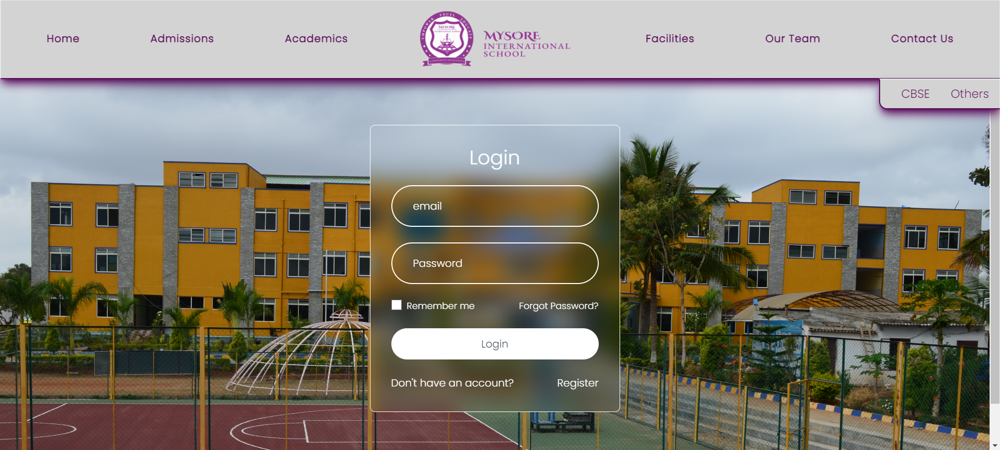

# Mysore International School

.png)
.png)
.png)
.png)
.png)
.png)

.png)
.png)

.png)
.png)
.png)
.png)
.png)
.png)

.png)

## Overview

Welcome to the Mysore International School's website, a comprehensive full-stack MERN (MongoDB, Express, React, Node.js) application. This freelancing project provides a robust platform for MIS, featuring extensive information about the school and staff. Key functionalities include a detailed admin panel for managing school operations, events, awards, admissions, and news. The site integrates Razorpay for secure fee payments, offers forms for parent and student queries, and maintains dynamic content updates, ensuring a seamless and informative experience for all users.

## Features

**Admin Panel**: Manage school operations, including student records, teacher information, and system settings.

**Events Management**: Create, update, and track school events, ensuring students and parents are well-informed.

**Awards And Achievements Management**: Record and manage school's / students achievements and awards, highlighting excellence within the school.

**Admission Process**: Streamline the admission process with online applications, review, and acceptance notifications.

**Payments**: Integrated with Razorpay for secure online fee payments and financial transactions.

**News Management**: Publish and update school news, keeping the community informed about important updates and announcements.

**Forms for Queries**: Facilitate communication with forms for parents and students to submit queries and receive timely responses.

**School Information**: Provide extensive information about the school, including staff profiles and department details.

**Additional Features**: Includes functionalities for managing class schedules, teacher assignments, and a resource library for study materials.

## Technologies Used

- **Frontend:**
  - React
  - Redux Toolkit(State Management)
  - React Router (Navigation)
  - Material-UI (UI Components)

- **Backend:**
  - Node.js
  - Express.js
  - MongoDB (Database)
  - Mongoose (ODM)
  - JWT (Authentication)
  - bcrypt (Password Hashing)
  - Node mailer
  

## Live Link

 - [LiveDemo](http://localhost:5173/)

## Stay-in-Touch

